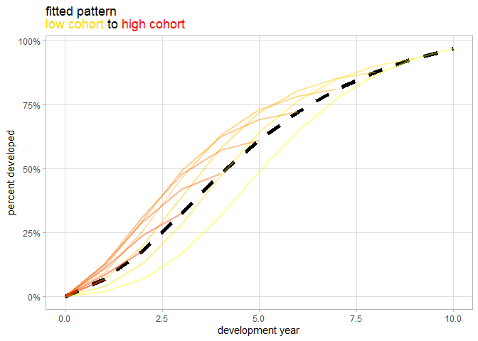
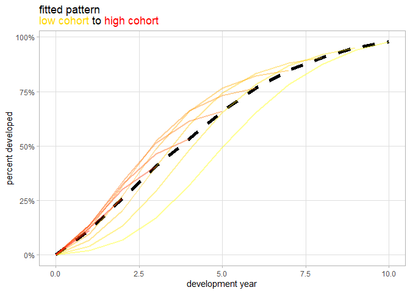

<!-- README.md is generated from README.Rmd. Please edit that file -->

# actuary

<!-- badges: start -->

[](https://github.com/andrewwilson201/actuary/actions/workflows/R-CMD-check.yaml)
<!-- badges: end -->

The `actuary` package provides actuarial modeling tools for Monte Carlo
loss simulations, loss reserving, and reinsurance layer loss
calculations. It enables users to generate stochastic loss datasets with
customisable frequency and severity distributions, fit development
patterns to claim triangles, and calculate reinsurance losses for
occurrence and aggregate layers with user-defined retentions, limits,
and reinstatements. For development pattern selection, the package
includes a machine learning approach that evaluates multiple reserving
models using holdout validation to identify the best-fitting pattern
based on predictive accuracy.

## Installation

You can install the development version of actuary from
[GitHub](https://github.com/andrewwilson201/actuary) with:

``` r
# install.packages("pak")
pak::pak("andrewwilson201/actuary")
```

## Examples

### Monte Carlo Loss Simulations

Generate simulated loss datasets using custom frequency and severity
distributions.

``` r
library(actuary)

# Simulate 100,000 years of loss data with Poisson frequency (mean = 5) and Lognormal severity (meanlog = 13, sdlog = 0.5)
sim_data <- create_simulations(
  num_sims = 100000, 
  mean_freq = 5, 
  sev_dist = "lognorm2", 
  sev_param1 = 13, 
  sev_param2 = 0.5
)

head(sim_data)
#> # A tibble: 6 × 2
#>    year     loss
#>   <int>    <dbl>
#> 1     1  507714.
#> 2     1  606701.
#> 3     1 1907113.
#> 4     1  323191.
#> 5     1  332311.
#> 6     2 1017178.
```

### Loss Reserving with Development Patterns

Fit a development pattern to a cumulative claims triangle.

``` r
# Example dataset
triangle_data <- actuary::triangle_data

# Fit chain-ladder model with optional smoothing
fit <- fit_development_pattern(
  cohort_var = uw_year, 
  dev_var = dev_year, 
  weighting_var = claim_number, 
  data = triangle_data, 
  smooth_from = 4
)

# View fitted development pattern
plot_development_pattern(fit)
```



### Machine Learning for Development Pattern Selection

Automatically select the best-fitting development pattern based on
holdout validation.

``` r
# Define multiple reserving model parameters for evaluation
params <- expand.grid(
  exclude_last_diag = c(TRUE, FALSE),
  smooth_from = c(3, 4),
  exclude_high = c(TRUE),
  exclude_low = c(TRUE),
  selected_curve = c("weibull", "exponential_decay"),
  num_periods = c(3, 4),
  future_dev_periods = c(0, 12)
)

# Run machine learning model selection
ml_result <- fit_development_pattern_ml(
  cohort_var = uw_year, 
  dev_var = dev_year, 
  weighting_var = claim_number, 
  data = triangle_data, 
  dev_period_length = 1, 
  dev_period_units = 12, 
  params_data = params
)
#> [==>-----------------------------------------]   6% eta: 12s[===>----------------------------------------]   9% eta: 15s[=====>--------------------------------------]  12% eta: 16s[======>-------------------------------------]  16% eta: 16s[=======>------------------------------------]  19% eta: 16s[=========>----------------------------------]  22% eta: 16s[==========>---------------------------------]  25% eta: 16s[===========>--------------------------------]  28% eta: 16s[=============>------------------------------]  31% eta: 15s[==============>-----------------------------]  34% eta: 15s[===============>----------------------------]  38% eta: 14s[=================>--------------------------]  41% eta: 13s[==================>-------------------------]  44% eta: 13s[====================>-----------------------]  47% eta: 12s[=====================>----------------------]  50% eta: 11s[======================>---------------------]  53% eta: 11s[========================>-------------------]  56% eta: 10s[=========================>------------------]  59% eta:  9s[===========================>----------------]  62% eta:  8s[============================>---------------]  66% eta:  8s[=============================>--------------]  69% eta:  7s[===============================>------------]  72% eta:  6s[================================>-----------]  75% eta:  6s[=================================>----------]  78% eta:  5s[===================================>--------]  81% eta:  4s[====================================>-------]  84% eta:  4s[=====================================>------]  88% eta:  3s[=======================================>----]  91% eta:  2s[========================================>---]  94% eta:  1s[==========================================>-]  97% eta:  1s[============================================] 100% eta:  0s

# View ranked results
ml_result$results
#> # A tibble: 32 × 14
#>    exclude_last_diag smooth_from exclude_high exclude_low selected_curve   
#>    <lgl>                   <dbl> <lgl>        <lgl>       <fct>            
#>  1 FALSE                       4 TRUE         TRUE        exponential_decay
#>  2 FALSE                       4 TRUE         TRUE        exponential_decay
#>  3 TRUE                        4 TRUE         TRUE        exponential_decay
#>  4 TRUE                        4 TRUE         TRUE        exponential_decay
#>  5 FALSE                       3 TRUE         TRUE        exponential_decay
#>  6 FALSE                       3 TRUE         TRUE        exponential_decay
#>  7 FALSE                       4 TRUE         TRUE        weibull          
#>  8 FALSE                       4 TRUE         TRUE        weibull          
#>  9 TRUE                        3 TRUE         TRUE        exponential_decay
#> 10 TRUE                        3 TRUE         TRUE        exponential_decay
#> # ℹ 22 more rows
#> # ℹ 9 more variables: num_periods <dbl>, future_dev_periods <dbl>,
#> #   ave_score <dbl>, huber_loss <dbl>, rmse <dbl>, mae <dbl>, cdr_score <dbl>,
#> #   neg_ave_score <dbl>, reserve <dbl>

# Plot best-fitting development pattern
plot_development_pattern(ml_result$best_fit)
```



### Reinsurance Layer Loss Calculations

Calculate occurrence and aggregate reinsurance losses.

``` r
# Example loss dataset
losses <- data.frame(
  year = rep(1:5, each = 5),
  amount = c(1e6, 3e6, 5e6, 7e6, 9e6, 2e6, 4e6, 6e6, 8e6, 10e6, 
             1.5e6, 3.5e6, 5.5e6, 7.5e6, 9.5e6, 2.5e6, 4.5e6, 6.5e6, 8.5e6, 10.5e6,
             3e6, 6e6, 9e6, 12e6, 15e6)
)

# Calculate 10M x 10M occurrence loss with one reinstatement
losses$occurrence_layer <- layer_loss(
  year = losses$year, 
  loss = losses$amount, 
  retention = 10e6, 
  limit = 10e6, 
  reinstatements = 1, 
  type = "occurrence"
)

# Calculate 10M x 10M aggregate layer loss with no reinstatements
losses$aggregate_layer <- layer_loss(
  year = losses$year, 
  loss = losses$amount, 
  retention = 10e6, 
  limit = 10e6, 
  reinstatements = 0, 
  type = "aggregate"
)

head(losses)
#>   year amount occurrence_layer aggregate_layer
#> 1    1  1e+06                0           0e+00
#> 2    1  3e+06                0           0e+00
#> 3    1  5e+06                0           0e+00
#> 4    1  7e+06                0           6e+06
#> 5    1  9e+06                0           4e+06
#> 6    2  2e+06                0           0e+00
```
